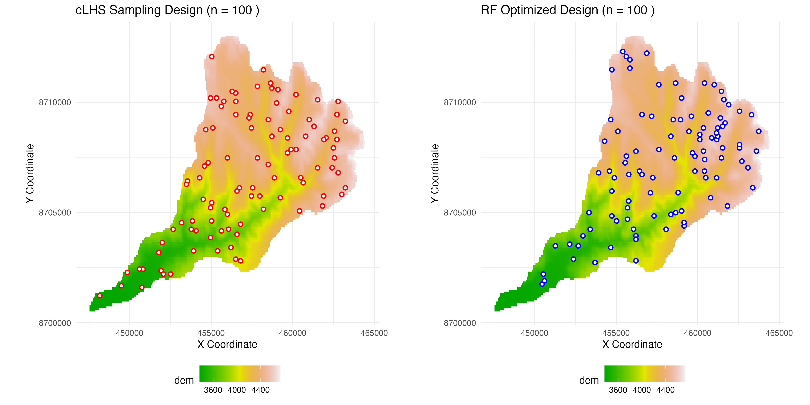

# Soil Sampling Optimization: cLHS + Random Forest

An R-based workflow that optimizes spatial sampling designs by combining **Conditioned Latin Hypercube Sampling (cLHS)** with **Random Forest (RF) optimization** using simulated annealing.

## 📊 Results Preview



**Performance Improvement:** The RF-optimized design achieved a **46.59% reduction in MSE** compared to the cLHS baseline.

| Method | MSE | Samples | Improvement |
|--------|-----|---------|-------------|
| cLHS | 0.0038 | 100 | 0% |
| RF Optimized | 0.0020 | 100 | 46.59% |

---

## 🎯 Overview

This project implements a two-stage optimization approach for spatial sampling:

1. **Stage 1: cLHS Sampling** - Generates representative samples covering the full range of environmental conditions
2. **Stage 2: RF Optimization** - Uses simulated annealing with Random Forest MSE as the objective function to refine sample locations

The result is a sampling design that is both environmentally representative and predictively optimal.

## 🔬 Methodology

### Conditioned Latin Hypercube Sampling (cLHS)
- Ensures samples cover the full distribution of environmental covariates
- Provides a statistically representative baseline design
- Guarantees coverage across the environmental feature space

### Random Forest Optimization
- **Algorithm:** Simulated annealing with Metropolis acceptance criterion
- **Objective Function:** Cross-validated Random Forest MSE (5-fold CV)
- **Mechanism:** Iteratively swaps sample points to minimize prediction error
- **Parameters:**
  - Initial temperature: 1000
  - Cooling rate: 0.95
  - Default iterations: 500

## 📋 Requirements

### R Packages
```r
install.packages(c("terra", "clhs", "randomForest", "ggplot2", "gridExtra"))
```

- `terra` - Spatial raster data handling
- `clhs` - Conditioned Latin Hypercube Sampling
- `randomForest` - Random Forest modeling
- `ggplot2` - Visualization
- `gridExtra` - Plot arrangement

## 🚀 Quick Start

### Basic Usage

```r
# Source the script
source("clhs_rf_optimized.R")

# Run with default parameters
results <- run_sampling_optimization(
  raster_file = "data/predictors.tif",
  n_samples = 100,
  n_iterations = 500,
  seed = 123
)
```

### Custom Configuration

```r
# Advanced usage with custom parameters
results <- run_sampling_optimization(
  raster_file = "data/predictors.tif",
  n_samples = 150,              # Number of sample points
  n_iterations = 1000,          # Optimization iterations
  output_dir = "outputs/",      # Output directory
  seed = 42,                    # Random seed for reproducibility
  target_var = NULL,            # Specific target variable
  export_results = TRUE         # Export CSV and plots
)
```

## 📂 Input Data

The script expects a multi-band GeoTIFF raster file with environmental covariates:

- **Format:** GeoTIFF (.tif)
- **Structure:** Multi-band raster where each band represents an environmental variable
- **Example:** `data/predictors.tif`

**Supported covariates:** DEM, slope, aspect, NDVI, TWI, soil properties, climate variables, etc.

## 📤 Output Files

All outputs are saved to the `outputs/` directory:

### CSV Files
1. **`clhs_sample_locations.csv`** - cLHS sample coordinates and covariate values
2. **`rf_optimized_locations.csv`** - RF-optimized sample coordinates and covariate values
3. **`sampling_comparison_table.csv`** - Performance metrics comparison

### Visualizations
4. **`sampling_comparison_plots.png`** - Side-by-side comparison plots showing:
   - Left: cLHS sampling design (red points)
   - Right: RF optimized design (blue points)

## 🔧 Workflow Steps

The optimization workflow consists of 5 main steps:

1. **Data Preparation** - Load and validate raster covariates
2. **cLHS Sampling** - Generate representative baseline samples
3. **RF Optimization** - Refine samples using simulated annealing
4. **Visualization** - Create comparison plots
5. **Export Results** - Save CSV files and visualizations

## 📊 Understanding the Results

### Returned Object

The function returns a list containing:

```r
results <- run_sampling_optimization(...)

# Access results
results$clhs_samples            # cLHS sample locations
results$rf_optimized_samples    # Optimized sample locations
results$comparison_table        # Performance comparison table
results$plots                   # ggplot2 plot objects
results$improvement             # Improvement percentage
```

### Interpretation

- **Lower MSE = Better sampling design** - Samples provide more accurate predictions
- **Improvement %** - How much the RF optimization reduced prediction error
- **Visual comparison** - Observe spatial redistribution of sample points

## 🎲 Reproducibility

The script uses separate seeds for different operations:

- **cLHS:** Uses the provided `seed`
- **RF Optimization:** Uses `seed + 1`

This ensures reproducible results while maintaining independence between sampling stages.

## 🔍 Algorithm Details

### Simulated Annealing Process

1. **Initialize** with cLHS samples
2. **For each iteration:**
   - Randomly select one sample point to replace
   - Choose a new point from remaining locations
   - Calculate MSE of candidate design
   - Accept or reject based on Metropolis criterion:
     - Always accept if MSE improves
     - Probabilistically accept if MSE worsens: P(accept) = exp(-Δ/T)
   - Cool temperature: T = T × 0.95
3. **Track** the best solution throughout the process

### Cross-Validation Strategy

- **Method:** k-fold cross-validation (default: 5 folds)
- **Model:** Random Forest with 100 trees
- **Metric:** Mean Squared Error (MSE) averaged across folds
- **Target:** Third covariate by default (customizable with `target_var`)

## 📈 Use Cases

This workflow is ideal for:

- **Environmental monitoring** - Optimizing soil sampling locations
- **Precision agriculture** - Strategic crop monitoring points
- **Ecological surveys** - Biodiversity assessment locations
- **Geological exploration** - Mineral or resource sampling
- **Climate studies** - Weather station placement

## 🤝 Contributing

For suggestions or improvements, please open an issue or submit a pull request.

## 📄 License

This project is open-source and available for educational and research purposes.

## 📚 References

### Key Papers
- Wadoux, A. M. J. C., Brus, D. J., & Heuvelink, G. B. M. (2019). Sampling design optimization for soil mapping with random forest. *Geoderma*, 355, Article 113913. https://doi.org/10.1016/j.geoderma.2019.113913
- Minasny, B., & McBratney, A. B. (2006). A conditioned Latin hypercube method for sampling in the presence of ancillary information. *Computers & Geosciences*, 32(9), 1378-1388.
- Breiman, L. (2001). Random forests. *Machine Learning*, 45(1), 5-32.
- Kirkpatrick, S., Gelatt, C. D., & Vecchi, M. P. (1983). Optimization by simulated annealing. *Science*, 220(4598), 671-680.

### R Packages
- Roudier, P., Beaudette, D. E., & Hewitt, A. E. (2012). A conditioned Latin hypercube sampling algorithm incorporating operational constraints. *5th Global Workshop on Digital Soil Mapping*.

## 📧 Contact

For questions or collaboration opportunities, please reach out through GitHub issues.

---

**Note:** This workflow automatically executes when the script is sourced. Comment out the last line in `clhs_rf_optimized.R` to disable automatic execution.
